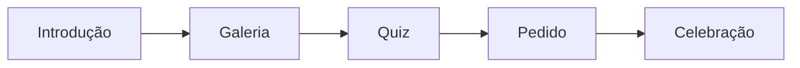

# 🏗️ Arquitetura da Aplicação - Pedido de Casamento

## 📋 Visão Geral

Esta aplicação foi modularizada seguindo princípios de **Clean Code** e **Engenharia de Software**, com separação clara de responsabilidades e código reutilizável.

## 🗂️ Estrutura de Diretórios

```
/home/reginaldojr/PedidoCasamento/
├── src/
│   ├── components/          # Componentes UI reutilizáveis
│   │   ├── __init__.py
│   │   └── styles.py       # Estilos CSS centralizados
│   │
│   ├── services/            # Lógica de negócio
│   │   ├── __init__.py
│   │   ├── music_service.py      # Gerenciamento de música
│   │   ├── quiz_service.py       # Lógica do quiz
│   │   └── page_manager.py       # Navegação entre páginas
│   │
│   ├── utils/               # Utilitários
│   │   ├── __init__.py
│   │   ├── file_utils.py         # Manipulação de arquivos
│   │   └── date_utils.py         # Cálculos de data
│   │
│   └── pages/               # Páginas da aplicação
│       └── __init__.py
│
├── app.py                   # Aplicação original (legacy)
├── app_modular.py           # Nova aplicação modular
├── app_backup.py            # Backup do original
└── pictures/                # Recursos estáticos
    └── music/
```

## 🎯 Princípios Aplicados

### 1. **Separation of Concerns (SoC)**
Cada módulo tem uma responsabilidade específica:
- **Components**: UI e estilos
- **Services**: Lógica de negócio
- **Utils**: Funções auxiliares
- **Pages**: Renderização de páginas

### 2. **Single Responsibility Principle (SRP)**
Cada classe tem uma única responsabilidade:
- `FileManager`: Gerencia arquivos
- `ImageProcessor`: Processa imagens
- `MusicService`: Gerencia música
- `QuizService`: Gerencia quiz
- `PageManager`: Gerencia navegação

### 3. **Don't Repeat Yourself (DRY)**
Código reutilizável centralizado:
- Estilos CSS em `StyleComponents`
- Processamento de arquivos em `FileManager`
- Lógica de quiz em `QuizService`

### 4. **Dependency Injection**
Serviços são injetados onde necessário:
```python
class WeddingProposalApp:
    def __init__(self):
        self.music_service = MusicService()
        self.quiz_service = QuizService()
        self.page_manager = PageManager()
```

## 📦 Módulos Principais

### 🎵 MusicService
**Responsabilidade**: Gerenciar música da aplicação

**Métodos**:
- `get_music_for_page(page)`: Retorna música apropriada
- `generate_music_player_html(page)`: Gera HTML do player

**Exemplo**:
```python
music_service = MusicService()
music_html = music_service.generate_music_player_html('intro')
```

### 📝 QuizService
**Responsabilidade**: Gerenciar lógica do quiz

**Métodos**:
- `get_questions()`: Retorna perguntas
- `get_success_message()`: Mensagem aleatória de acerto
- `get_error_message(correct_answer)`: Mensagem de erro
- `calculate_statistics(answers, questions)`: Calcula estatísticas

**Exemplo**:
```python
quiz_service = QuizService()
questions = quiz_service.get_questions()
stats = quiz_service.calculate_statistics(answers, questions)
```

### 🗺️ PageManager
**Responsabilidade**: Gerenciar navegação entre páginas

**Métodos**:
- `register_page(page_type, function)`: Registra página
- `navigate_to(page_type)`: Navega para página
- `render_current_page()`: Renderiza página atual

**Exemplo**:
```python
page_manager = PageManager()
page_manager.register_page(PageType.INTRO, show_intro_page)
page_manager.navigate_to(PageType.GALLERY)
```

### 📁 FileManager
**Responsabilidade**: Gerenciar arquivos (imagens, vídeos, músicas)

**Métodos**:
- `get_image_files(directory)`: Lista imagens
- `get_video_files(directory)`: Lista vídeos
- `get_music_files(directory)`: Lista músicas
- `get_media_files(directory)`: Lista todas mídias
- `is_video_file(path)`: Verifica se é vídeo

**Exemplo**:
```python
file_manager = FileManager()
images = file_manager.get_image_files('pictures')
```

### 🖼️ ImageProcessor
**Responsabilidade**: Processar imagens e converter para base64

**Métodos**:
- `image_to_base64(path, max_width)`: Converte imagem
- `video_to_base64(path)`: Converte vídeo
- `audio_to_base64(path)`: Converte áudio

**Exemplo**:
```python
processor = ImageProcessor()
img_base64 = processor.image_to_base64('pictures/1.jpg')
```

### 📅 DateCalculator
**Responsabilidade**: Calcular tempo de relacionamento

**Métodos**:
- `calculate_relationship_time(start_date)`: Calcula tempo

**Exemplo**:
```python
calculator = DateCalculator()
time_data = calculator.calculate_relationship_time()
print(f"{time_data['years']} anos, {time_data['months']} meses")
```

## 🎨 Componentes de Estilo

### StyleComponents
**Responsabilidade**: Fornecer estilos CSS reutilizáveis

**Métodos**:
- `get_global_styles()`: Estilos globais
- `get_romantic_background()`: Fundo romântico animado
- `get_button_styles()`: Estilos de botões

**Exemplo**:
```python
styles = StyleComponents()
st.markdown(styles.get_global_styles(), unsafe_allow_html=True)
st.markdown(styles.get_romantic_background(), unsafe_allow_html=True)
```

## 🔄 Fluxo de Navegação



## 🚀 Como Usar

### Executar Versão Modular
```bash
streamlit run app_modular.py
```

### Executar Versão Original
```bash
streamlit run app.py
```

## 🔧 Manutenção

### Adicionar Nova Página
1. Criar função de renderização
2. Registrar no PageManager
3. Adicionar ao PageType enum

```python
class PageType(Enum):
    NEW_PAGE = "new_page"

page_manager.register_page(PageType.NEW_PAGE, show_new_page)
```

### Adicionar Nova Música
1. Colocar arquivo em `music/`
2. MusicService detecta automaticamente

### Modificar Estilos
1. Editar `src/components/styles.py`
2. Estilos aplicam automaticamente

## 📊 Benefícios da Modularização

✅ **Manutenibilidade**: Código organizado e fácil de manter  
✅ **Testabilidade**: Módulos podem ser testados isoladamente  
✅ **Reutilização**: Componentes reutilizáveis em toda aplicação  
✅ **Escalabilidade**: Fácil adicionar novas funcionalidades  
✅ **Legibilidade**: Código mais limpo e compreensível  
✅ **Separação**: Lógica de negócio separada da apresentação  

## 🔮 Próximos Passos

- [ ] Migrar todas as páginas para versão modular
- [ ] Adicionar testes unitários
- [ ] Implementar cache para melhorar performance
- [ ] Adicionar logging estruturado
- [ ] Implementar programação assíncrona onde aplicável
- [ ] Adicionar type hints completos
- [ ] Criar documentação de API

## 📝 Notas

- A versão original (`app.py`) continua funcionando
- A versão modular (`app_modular.py`) é a nova arquitetura
- Migração gradual está em andamento
- Backup disponível em `app_backup.py`

